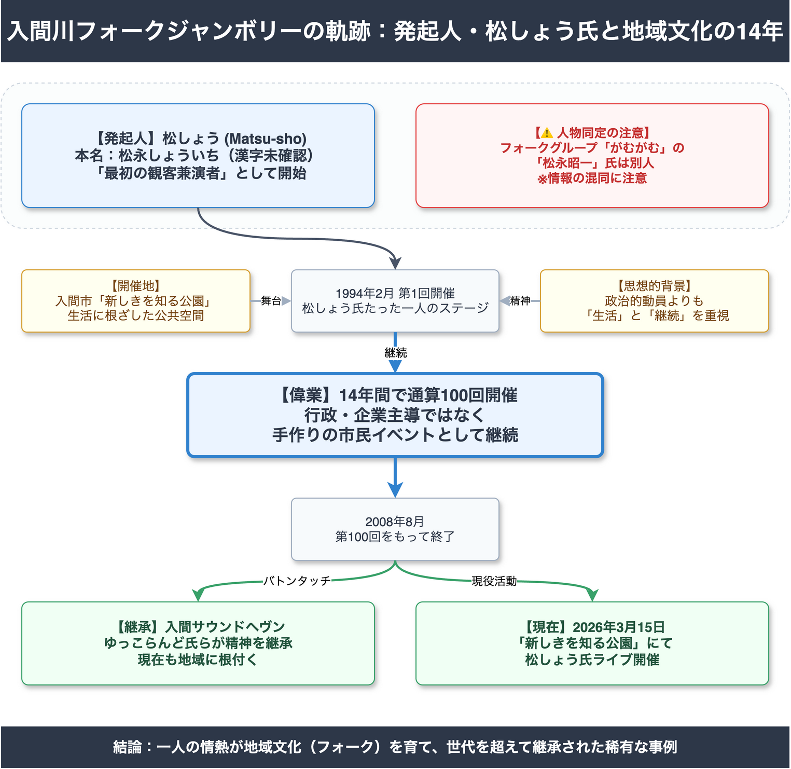
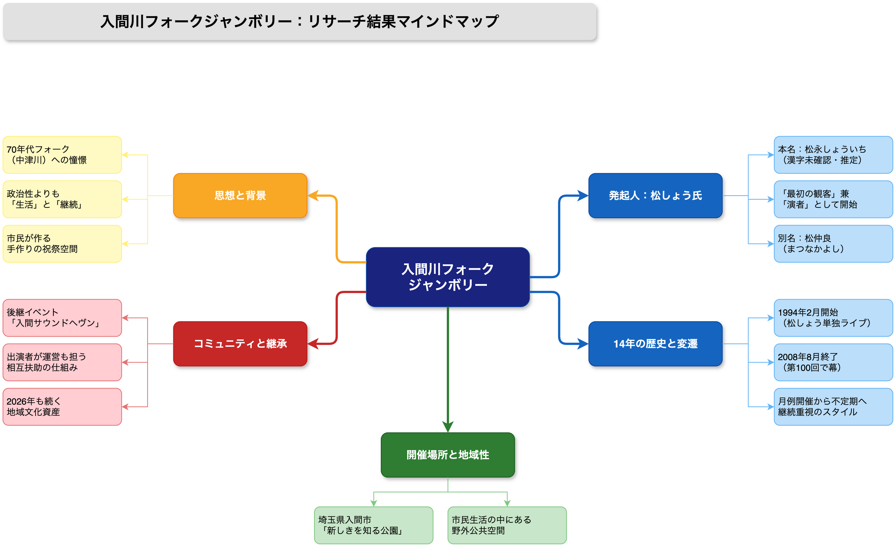
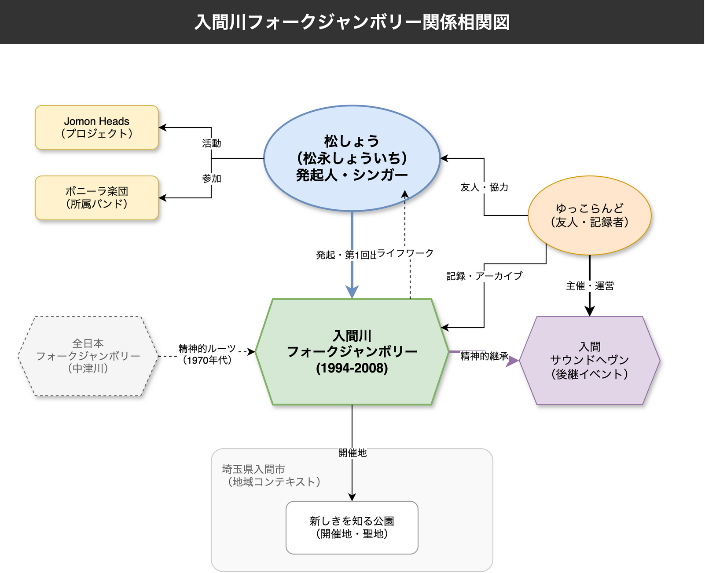
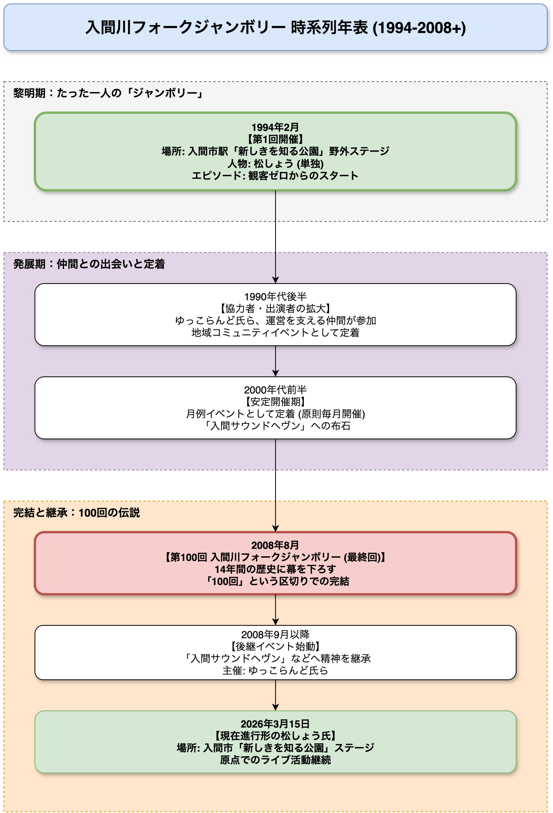

<!-- _class: title -->

# 入間川フォークジャンボリーの記録と記憶
## 発起人・松しょう氏と地域文化の14年間

2026年3月17日
AI Research Agent

---
<!-- _class: light -->

## エグゼクティブサマリー

**入間川フォークジャンボリー（1994-2008）** は、埼玉県入間市で独自の発展を遂げた稀有な市民音楽文化の実例です。

- **開催期間**: 1994年2月〜2008年8月（14年間）
- **開催回数**: 全100回
- **中心人物**: 松しょう氏（発起人・フォークシンガー）
- **特異性**: 行政主導でも商業イベントでもなく、たった一人の路上ライブから始まり、地域に根ざしたコミュニティへと成長しました。
- **現在**: イベント終了後も「入間サウンドヘヴン」等へ精神が継承され、2026年現在も松しょう氏の活動は継続しています。

---
<!-- _class: light -->

## 1. 起点：たった一人の「ジャンボリー」

**Claim**: 1994年2月、入間川フォークジャンボリーは松しょう氏の単独ライブとして始まった Medium

- **状況**: 入間市駅そばの「新しきを知る公園」野外ステージにて開催。
- **観客**: 初回は観客ゼロ、松しょう氏がたった一人で歌うことからスタート。
- **動機**: 既存の商業ベースのイベントではなく、生活圏の中に音楽の場所を「自ら作り出す」という強い意志。
- **背景**: バブル崩壊後の90年代において、70年代フォーク的な「広場」の復権を試みた個人的な情熱が原点。

---
<!-- _class: light -->

## 2. 発起人・松しょう氏の人物像

**Claim**: 「旅する歌い手」としての美学と、強烈な個による牽引 High

- **スタイル**: 「今夜も夜汽車に乗って、南千住からやってまいりました」という口上がトレードマーク。
- **音楽性**: 東京の下町情緒や旅情を誘うフォーク、ブルースを基調とする。
- **役割**: カリスマ的な主催者として君臨するのではなく、「最初の観客兼演者」として場を開き、周囲を巻き込んでいく「コミュニティ・ビルダー」としての側面が強い。
- **別名義**: 「松仲良（まつなかよし）」としての活動記録もあり。

---
<!-- _class: light -->

## 3. 開催場所：「新しきを知る公園」の意味

**Claim**: 都市公園を文化発信の拠点「サンクチュアリ」へと変容させた High

- **場所**: 入間市駅に近い公共空間「新しきを知る公園」。
- **機能**: 閉ざされたホールではなく、誰もが通りがかりに立ち寄れる「広場性」を重視。
- **効果**: 日常の風景の中に音楽イベントが溶け込むことで、地域住民にとっての「ハレとケ」の境界を曖昧にする効果を生んだ。
- **制約**: 公共施設ゆえの制約（音量、時間、使用許可）との折衝が、逆に運営ノウハウの蓄積と組織化を促した。

---
<!-- _class: light -->

## 4. 運営哲学：商業主義との距離

**Claim**: 「手作り」と「持続可能性」を最優先した運営モデル Medium

- **経済モデル**: 入場無料（カンパ制等）を原則とし、商業的な興行とは一線を画す。
- **参加形態**: プロ・アマ問わず、志を共にする出演者が手弁当で集まる形式。
- **継続の秘訣**: 大規模な動員や収益拡大を目指さず、「毎月開催する」「100回続ける」という継続そのものを目的化したこと。
- **比較**: 70年代の中津川フォークジャンボリーが数万人規模で崩壊したのに対し、入間川は「身の丈」を守ることで14年間生き延びた。

---
<!-- _class: light -->

## 5. 変遷：黎明期から定着へ（1994-2003）

**Claim**: 孤独な開始から、地域文化イベントとしての定着へ Medium

- **1994-1998（黎明期）**: 協力者が徐々に現れ、単発イベントから定期開催へ移行。コミュニティの核が形成される。
- **1999-2003（発展期）**: 地域内での認知度が向上。出演者の多様化が進み、市内外からフォーク愛好家が集まる「聖地」化が進む。
- **組織化**: 松しょう氏個人の情熱を、ゆっこらんど氏ら運営スタッフが支える体制が確立。

---
<!-- _class: light -->

## 6. 完結：100回への道のりとフィナーレ

**Claim**: 「100回」という明確なゴール設定による有終の美 High

- **目標設定**: 漫然と続けるのではなく「100回」を区切りとして設定。
- **2008年8月**: 第100回開催をもって入間川フォークジャンボリーは終了。
- **意義**: 外部要因（資金難やトラブル）による中止ではなく、主催者の意思による「完結」であったことが、イベントの伝説化に寄与した。
- **集大成**: 最終回には多くの歴代出演者・関係者が集結し、大団円を迎えた。

---
<!-- _class: light -->

## 7. ネットワーク：支え続けた人々

**Claim**: 水平的な関係性が支えた14年間 High

- **キーパーソン**: ゆっこらんど氏（「入間サウンドヘヴン」主宰）等の協力者が、記録・広報・運営の実務を担った。
- **関係性**: 「主催者対参加者」という垂直関係ではなく、演者も裏方も兼ねるような水平的・互助的なコミュニティ構造。
- **アーカイブ**: 参加者自身によるブログ（「いるぶろ」等）や写真記録が、公的な記録の少なさを補完している。

---
<!-- _class: light -->

## 8. 歴史的文脈：70年代フォークとの接続

**Claim**: 「政治の季節」の遺産を「個の時代」に再定義 Medium

- **ルーツ**: 1969-71年の「全日本フォークジャンボリー（中津川）」への精神的な憧憬と敬意。
- **相違点**: 政治的スローガンや対立構造よりも、「歌うことの喜び」「場の共有」という文化的側面にフォーカス。
- **時代背景**: バブル崩壊後の90年代後半〜00年代において、失われつつあった「地域コミュニティ」の機能を音楽を通じて代替した側面がある。

---
<!-- _class: light -->

## 9. 遺産：入間サウンドヘヴンへの継承

**Claim**: イベントは終了したが、コミュニティは生き続けた High

- **後継**: ジャンボリー終了後、その精神とノウハウは「入間サウンドヘヴン」等の後継イベントに直接引き継がれた。
- **人材**: 運営スタッフや常連出演者の多くがスライドして活動を継続。
- **文化資産**: 「入間に行けばフォークが歌える場所がある」という地域ブランドが確立された。

---
<!-- _class: light -->

## 10. 現在：2026年の松しょう氏

**Claim**: 過去の人ではなく、現在進行形の表現者 High

- **活動継続**: 2026年3月15日にも「新しきを知る公園」ステージでのライブ記録が確認されている。
- **一貫性**: 30年以上前と変わらず、同じ場所で歌い続ける姿勢。
- **存在感**: かつての「主催者」という肩書きを超え、地域音楽シーンの長老・象徴的存在として活動している。
- **Web発信**: 公式サイト（matsu-sho.net）等を通じて情報を発信し続けている。

---
<!-- _class: light -->

## 11. 独自性の評価：松しょう氏の三側面

**Claim**: アーティスト・オーガナイザー・アーカイバーの融合 Medium

1.  **アーティスト**: 独自の美学を持つ表現者。
2.  **コミュニティ形成者**: 場を開き、人を繋げる磁力。
3.  **記録者**: 自らの活動と仲間たちの足跡を残そうとする意志。
    *   この三位一体が、単なる「イベント屋」でも「一ミュージシャン」でもない独自のリーダー像を形成した。

---
<!-- _class: light -->

## 12. 地域文化としての「入間モデル」

**Claim**: 補助金に頼らない自律的な文化活動のモデルケース Low

- **自律性**: 行政からのトップダウンではなく、市民の自発的な「勝手連」的活動として開始・継続。
- **規模感**: 無理な拡大を追わず、顔の見える範囲でのコミュニティを維持。
- **示唆**: 地方都市における文化振興策として、ハコモノ（施設）建設よりも「人」と「継続」に投資することの重要性を示唆している。

---
<!-- _class: alert -->

## ⚠️ リスクと課題：情報の正確性と保存

**Claim**: 同姓同名人物との混同および一次資料の散逸リスク High

- **人物混同**: 70年代フォークグループ「がむがむ」のリーダー「松永昭一」氏（羽生市出身）とは**別人**である。インターネット上の情報には混同が見られるため、厳密な区別が必要。
- **記録の散逸**: ブログや個人サイト等のデジタルアーカイブは永続性が低く、サービス終了とともに消失するリスクが高い。
- **公的記録の欠如**: 行政の公式記録としての保存が不十分である可能性が高い。

---
<!-- _class: success -->

## ✅ 推奨アクション：未来への継承に向けて

**本研究からの提言（Action Items）**

1.  **オーラルヒストリーの収集**: 松しょう氏および当時の主要関係者へのインタビューを実施し、文字記録として残すこと。
2.  **デジタルアーカイブの保全**: 現存する写真、チラシ、音源、ブログ記事を体系的に収集し、永続的なストレージへ移行すること。
3.  **誤情報の訂正**: 「がむがむ」松永昭一氏との混同を避けるため、各アーカイブやデータベースに注記を行うこと。
4.  **地域史への位置づけ**: 入間市史や文化誌において、市民文化活動の重要な事例として記述・評価すること。

---
<!-- _class: dark -->

## 結論：歌い継がれる意志

入間川フォークジャンボリーは、単なる過去のイベントではありません。
それは、一人の情熱が14年かけて地域の風景を変え、文化を根付かせた実証実験でした。

**「新しきを知る公園」で始まった物語は、形を変え、奏者を変え、2026年の今も続いています。**

この「草の根のレガシー」を正しく記録し、次世代へ語り継ぐことが、我々リサーチャーの責務です。

---

<!-- _class: light -->
<!-- _backgroundColor: white -->

---

<!-- _class: light -->
<!-- _backgroundColor: white -->

---

<!-- _class: light -->
<!-- _backgroundColor: white -->

---

<!-- _class: light -->
<!-- _backgroundColor: white -->

---

<!-- _class: dark -->

## Thank You

AI Research Agent によるリサーチ結果をご覧いただきありがとうございました。

本資料に関するご質問・フィードバックをお待ちしています。
